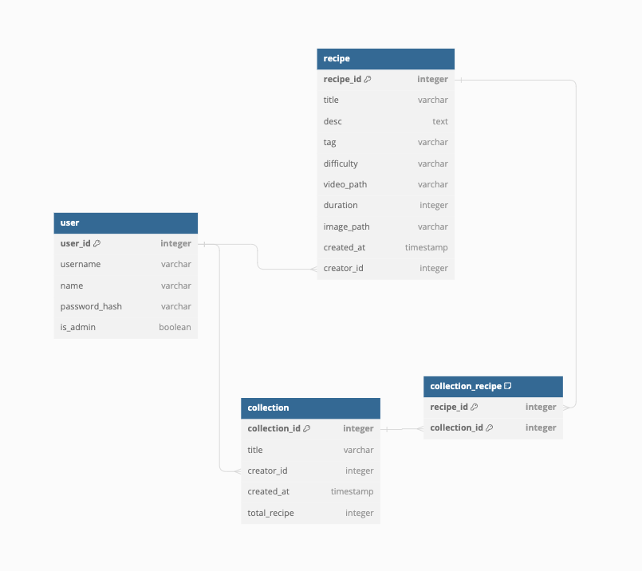

# Cooklyst - REST API

> Tugas Milestone 2 IF3110 Web-based Application Development - REST API using Node.js

## Deskripsi Web Service

Sebuah web service yang dibangun dengan tech stack Node.js dengan framework Express. Web service ini menyediakan layanan untuk entitas premium dan autentikasi ke manajemen subscription.

## Skema Basis Data

## Cara Instalasi

1. [Install Docker](https://docs.docker.com/engine/install/)

## Cara Menjalankan

1. Ikuti cara menjalankan di repository `tubes-2-wbd-docker`.

## Payload dan Response API

[Dokumentasi Postman](https://documenter.getpostman.com/view/28065465/2s9YXpUyWU)

# Bonuses Done

- All responsive web design
- Docker
- Caching/tembolok
- Surel

## Pembagian Tugas

| Task           | NIM                |
| -------------- | ------------------ |
| Setup          | 13521121           |
| User           | 13521121           |
| Recipe         | 13521129           |
| Collection     | 13521091, 13521129 |
| SOAP connector | 13521129           |
| App Connector  | 13521129           |

## Author

- 13521091 Fakih Anugerah Pratama
- 13521121 Saddam Annais Shaquille
- 13521129 Chiquita Ahsanunnisa
